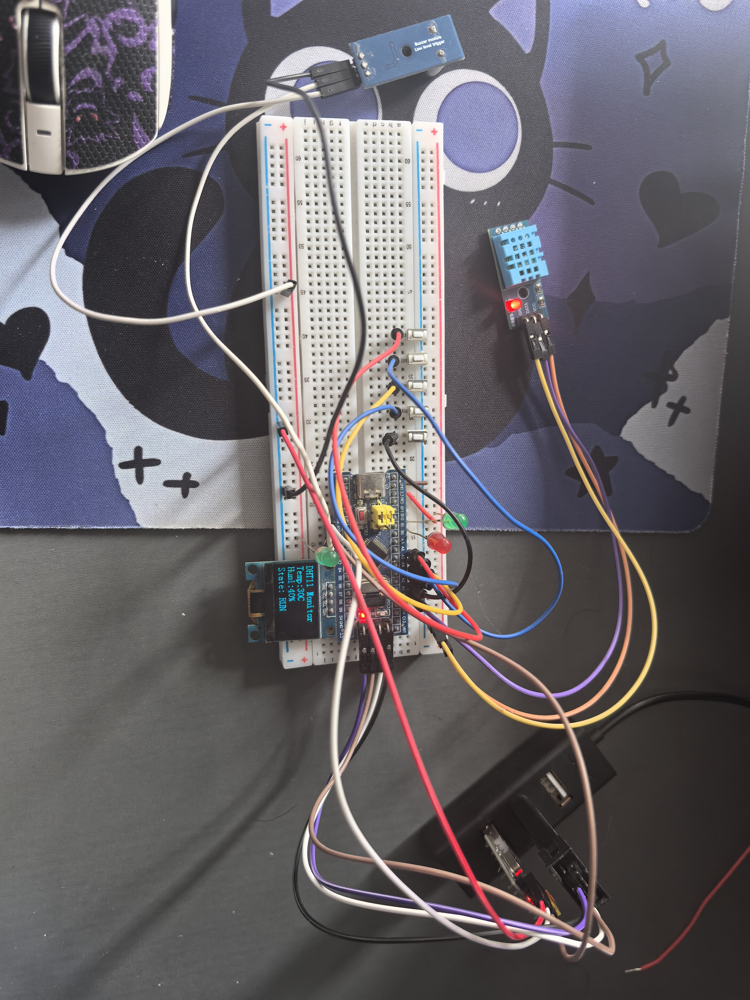

# 智能温湿度监测与报警系统（FreeRTOS 版）

基于 **STM32F103C8T6** 标准库 + **FreeRTOS V10.3.1** 开发的嵌入式多任务实战项目。在裸机版双层状态机架构的基础上，将传感器采集、OLED 显示、报警处理、按键扫描拆分为独立 FreeRTOS 任务，通过队列进行任务间通信。

> 本项目配套 [Python 上位机](https://github.com/Luoka666/upper_computer)，通过串口接收数据并在 PC 端绘制实时温湿度动态曲线，实现从单片机到 PC 端的完整数据闭环。
>
> 本项目同时维护两个版本：[裸机版（标准库状态机）](../Temperature_Humidity_Sensor_Alarm_System_BareMetal/) | **FreeRTOS 版（当前）**



---

## 目录

- [功能特性](#功能特性)
- [FreeRTOS 任务架构](#freertos-任务架构)
- [文件结构](#文件结构)
- [使用说明](#使用说明)
- [FreeRTOS 移植与重构踩坑记录](#freertos-移植与重构踩坑记录)
- [待优化方向](#待优化方向未来计划)

---

## 功能特性

裸机版全部功能 + FreeRTOS 新增特性：

- **多任务并发**：6 个独立 Task（Sensor / StateMachine / Alarm / Display / Record / Key）通过队列通信
- **队列解耦**：传感器数据通过 3 条队列分发给不同消费者，各 Task 独立消费互不抢夺
- **互斥锁 + 临界区**：OLED 访问双重保护，模块级互斥 + I2C 底层防抢占
- **非阻塞延时**：`vTaskDelay()` 替代 `Delay_ms()`，CPU 不空转
- **硬件定时器延时**：TIM2 提供微秒级精确延时，保护 DHT11 通信时序
- **Tick Hook 兼容**：FreeRTOS Tick Hook 替代裸机 SysTick_Handler，保留 g_millis

---

## 架构演进过程

| 版本 | 说明 |
| :--- | :--- |
| v0.1 | 裸机 `if-else` 驱动 DHT11 与 OLED，验证底层硬件 |
| v0.2 | 引入 `SystemState` 枚举，搭建双层 `switch-case` 状态机骨架 |
| v0.3 | 补全 7 种状态的 UI 绘制函数，实现菜单光标导航 |
| v0.4 | 添加清屏优化机制，解决画面闪烁与字符残留 |
| v0.5 | 接入串口调试输出，定位按键误触发与状态横跳 Bug |
| v0.6 | 修正 GPIO 时钟与端口配置错误，按键功能恢复正常 |
| v0.7 | 引入环形缓冲区，重构历史记录存储与显示逻辑 |
| v0.8 | 集成非阻塞式 LED 报警闪烁，RUN 状态下菜单锁定 |
| v0.9 | 主循环升级为非阻塞事件驱动架构，重构延时函数保护系统心跳 |
| v1.0 | 移植 FreeRTOS：拆分为 Sensor / Display / Alarm / Key 四个任务，队列通信 |

---

## FreeRTOS 任务架构

### 任务列表

| 任务 | 优先级 | 栈大小 | 周期 | 职责 |
|------|--------|--------|------|------|
| **Sensor** | 3（最高） | 128 | 100ms | RUN 状态下采集 DHT11，广播到 sensorQueue / alarmQueue / recordQueue |
| **StateMachine** | 2 | 256 | 事件驱动 | 从 keyQueue 取键值，管理 7 种系统状态跳转 + UI 绘制 |
| **Alarm** | 2 | 128 | 事件驱动 | 从 alarmQueue 取数据，判断阈值，LED+蜂鸣器 500ms 周期报警 |
| **Display** | 1 | 256 | 事件驱动 | 从 sensorQueue 取数据，RUN 状态下刷新 OLED 温湿度显示 |
| **Record** | 1 | 128 | 事件驱动 | 从 recordQueue 取数据，写入环形缓冲区（复用裸机版 history_add） |
| **Key** | 1 | 128 | 20ms 轮询 | 调用 Key_GetNum() 扫描按键，键值通过 keyQueue 发送 |

### 队列设计

| 队列 | 深度 | 数据类型 | 生产者 | 消费者 |
|------|------|----------|--------|--------|
| `sensorQueue` | 5 | `SensorData_t` | Sensor Task | Display Task |
| `alarmQueue` | 5 | `SensorData_t` | Sensor Task | Alarm Task |
| `recordQueue` | 5 | `SensorData_t` | Sensor Task（timeout=0 非阻塞发送） | Record Task |
| `keyQueue` | 5 | `uint8_t` | Key Task | StateMachine Task |

### 互斥锁

| 锁 | 保护对象 | 使用者 |
|----|----------|--------|
| `oledMutex` | OLED 模块级别访问互斥 | Display Task、StateMachine Task |

OLED 底层 I2C 通信额外由 `taskENTER_CRITICAL()` 保护，互斥锁 + 临界区双重保护。

### 数据流

```
DHT11 → Sensor Task → sensorQueue → Display Task → OLED（RUN 状态下）
                    → alarmQueue  → Alarm  Task → LED/Buzzer
                    → recordQueue → Record Task → 环形缓冲区

按键 → Key Task → keyQueue → StateMachine Task → 状态跳转 + UI 绘制
```

### 优先级设计原则

- Sensor 优先级最高，DHT11 微秒级通信期间不能被其他任务抢占
- Alarm 优先级中等，数据到达时立即响应
- Display 和 Key 优先级最低且同级，时间片轮转，不干扰 Sensor

### 裸机架构保留部分

- `Hardware/` 驱动层（OLED、LED、Key、Buzzer）沿用裸机版
- `System/` 逻辑层（DHT11、USART、alarm、UI、Record_storage）沿用裸机版
- `UI.c` 中的 UI 函数继续被 Display Task 调用
- `alarm.c` 中的 `alarm_run()` 逻辑已迁移到 Alarm Task
- 启动文件栈空间从 0x400 扩大到 0x800，向量表指向 FreeRTOS 中断处理函数

---

## 文件结构

```
/Hardware                  // 硬件驱动层（与裸机版共用）
├── OLED.c / OLED.h
├── Key.c / Key.h
├── LED.c / LED.h
├── buzzer.c / buzzer.h
└── timer_delay.c / timer_delay.h   // TIM2 硬件定时器延时

/System                    // 系统逻辑层（与裸机版共用）
├── dht11.c / dht11.h
├── USART.c / USART.h
├── alarm.c / alarm.h
├── UI.c / UI.h
├── Record_storage.c / Record_storage.h
└── delay.c / delay.h

/FreeRTOS/Source           // FreeRTOS V10.3.1 内核
├── tasks.c / queue.c / list.c / timers.c ...
├── include/
└── portable/RVDS/ARM_CM3/ + MemMang/

/Tasks                     // FreeRTOS 任务层（新增）
├── task_sensor.c / .h       // 传感器采集任务
├── task_statemachine.c / .h // 状态机任务（7 状态跳转 + UI 绘制）
├── task_display.c / .h      // OLED 显示任务
├── task_alarm.c / .h        // 报警任务
├── task_record.c / .h       // 历史记录存储任务
└── task_key.c / .h          // 按键扫描任务

/User
├── main.c                 // 硬件初始化 + 队列/任务创建 + 启动调度器
├── FreeRTOSConfig.h       // FreeRTOS 内核配置（72MHz / 1ms tick / 10KB heap）
└── stm32f10x_it.c         // 中断服务（SysTick 由 FreeRTOS 接管，Tick Hook 维护 g_millis）
```

---

## 使用说明

### 硬件连接

| 外设 | STM32 引脚 | 说明 |
| :--- | :--- | :--- |
| **DHT11** | PA0 | 单总线数据引脚 |
| **OLED (I2C)** | SCL: PB8, SDA: PB9 | 0.96 寸 128x64 |
| **按键 K1** | PA1 | 运行/停止总开关 |
| **按键 K2** | PA2 | 确认/保存 |
| **按键 K3** | PA3 | 向上/递增 |
| **按键 K4** | PA4 | 向下/递减 |
| **按键 K5** | PA5 | 设置/返回 |
| **报警 LED** | PA11 | 超阈值闪烁报警 |
| **蜂鸣器** | PA12 | 超阈值鸣叫报警 |
| **USART1** | TX: PA9, RX: PA10 | 串口发送至上位机 |

### Keil 编译配置

- Options for Target → C/C++ → Include Paths 需添加：`User`、`Tasks`、`FreeRTOS/Source/include`、`FreeRTOS/Source/portable/RVDS/ARM_CM3`
- Target 需勾选 Use MicroLIB

---

## FreeRTOS 移植与重构踩坑记录

### 故障现象01
编译报错 `identifier "sensorQueue" is undefined`、`identifier "SensorData_t" is undefined` 等符号未定义。

### 故障原因01
新建的 `Tasks/` 文件夹路径未添加到 Keil 的 C/C++ 包含路径中，编译器找不到 `task_sensor.h` 等头文件。

### 解决方案01
Options for Target → C/C++ → Include Paths 添加 `Tasks` 文件夹路径。

---

### 故障现象02
编译通过，链接时报 `L6200E: Symbol SysTick_Handler multiply defined`，由 `stm32f10x_it.o` 和 `port.o` 重复定义。

### 故障原因02
裸机工程中 `stm32f10x_it.c` 定义了 `SysTick_Handler`，而 FreeRTOS 的 `port.c` 也需要接管 SysTick。两个文件中存在同名函数，链接器不知道该用哪一个。

### 解决方案02
在 `FreeRTOSConfig.h` 中配置 `#define xPortSysTickHandler SysTick_Handler`，让 FreeRTOS 的 SysTick 处理函数替换原来的。删除 `stm32f10x_it.c` 中的 `SysTick_Handler` 定义，只保留 FreeRTOS 版本。

---

### 故障现象03
串口持续打印 `DHT11 fail`，传感器完全无法工作。烧录裸机程序到同一块板子上，DHT11 正常工作，排除硬件故障。

### 故障原因03
DHT11 的通信时序是微秒级的，FreeRTOS 的 SysTick 中断（每 1ms 一次）和任务调度会打断通信过程中的精确延时。裸机下使用的软件循环 `Delay_us` 基于 CPU 空转，精度受编译器优化等级影响，在 FreeRTOS 工程中与裸机工程可能存在差异。

最初尝试的三种保护方案——`vTaskSuspendAll()` 挂起调度器、`taskENTER_CRITICAL()` 进入临界区、`__disable_irq()` 关闭全局中断——均无效。后经排查，杜邦线接触不良是导致早期测试结果不稳定的隐藏因素。

### 解决方案03

- 更换所有杜邦线，确保物理连接可靠
- 使用硬件定时器 TIM2 实现精确微秒延时（配置为 1MHz 计数频率，每个计数 = 1μs），替代软件循环 `Delay_us`，同时提供 `Delay_ms_TIM` 用于毫秒级延时。硬件定时器的精度完全由硬件保证，不受任务调度、中断、编译器优化等任何软件因素影响，也不再需要关闭中断来保护时序

---

### 故障现象04
传感器任务发送约 6 次数据后停止，串口不再有任何输出。系统完全沉默，必须手动复位才能恢复。

### 故障原因04
队列深度为 5，使用 `portMAX_DELAY` 作为发送超时参数。传感器每 100ms 采集一次，往队列里塞一条数据。显示任务和报警任务尚未创建，队列没有消费者，数据只进不出。塞满 5 条后，第 6 次发送时任务永久进入阻塞态，等待永远不会到来的空位。

### 解决方案04

- 立即修复：创建显示任务和报警任务作为消费者，从队列取数据，让队列有进有出
- 防御性优化：报警任务在未超阈值时不再执行 `vTaskDelay(200)`，只关灯后立刻回到队列阻塞，确保消费速度跟上生产速度，避免队列积压反压传感器任务

---

### 故障现象05
按一次按键 K1 后，串口短暂打印 `Key=1`，随后整个系统完全停止——串口不再打印温湿度数据，也不打印 `DHT11 fail`。如果不按任何按键，系统正常运行。

### 故障原因05

**直接原因**：传感器任务在 `xQueueSend` 上永久阻塞，队列满且无人消费。

**根本原因**：按键任务使用裸机版阻塞式 `Key_GetNum()`，内部有 `while(GPIO_ReadInputDataBit(...) == 0);` 等待松手的死循环。按键按下后，这个循环会空转约 150ms（人的按键时长）。在这期间，按键任务不调用任何 FreeRTOS 阻塞 API（`vTaskDelay`、`xQueueReceive` 等），内核不知道它在"等待"，只以为它在"执行"。按键任务和传感器任务当时是同优先级（均为 2），内核不会把 CPU 从"正在工作"的按键任务切走，传感器任务被"饿死"——处于就绪态，但得不到 CPU 时间。传感器任务被暂停期间，显示任务和报警任务也得不到执行，队列中的数据无人消费。按键松手后，传感器任务恢复，但队列可能已满，`xQueueSend` 上的 `portMAX_DELAY` 让任务永久阻塞。整个系统进入死锁状态。

**为什么裸机没有这个问题**：裸机下只有一个主循环，死等松手不影响任何其他逻辑。FreeRTOS 下多个任务共享 CPU，一个任务死等等于剥夺其他任务的 CPU 时间。

### 解决方案05

- 调整任务优先级：传感器任务升至最高（3），按键任务降至最低（1）。利用 FreeRTOS 的抢占式调度机制，即使按键任务在 while 空转，内核在每次 SysTick 中断时检查到高优先级的传感器任务就绪，会立刻抢占 CPU，传感器任务不再被饿死
- 后续优化方向：用 FreeRTOS 软件定时器实现非阻塞按键消抖，彻底消除 while 空转，从根源上解决问题

---

### 故障现象06
系统运行过程中 OLED 随机黑屏，但串口继续正常打印温湿度数据，传感器采集和报警功能均正常。按 K1 切换到 RUN 状态后，屏幕有时能恢复显示。

### 故障原因06
软件模拟 I2C 在多任务环境下被抢占。两个任务（显示任务和状态机任务）可能同时尝试操作 OLED，虽然外层有互斥锁保护，但在 `OLED_WriteCommand` 和 `OLED_WriteData` 内部，I2C 的 SDA 数据线在通信过程中可能被另一个任务的 I2C 操作打断，导致 SDA 被拉低后无法释放，I2C 总线进入死锁状态。OLED 收不到完整的命令序列，内部状态机混乱，屏幕黑屏。

### 解决方案06
在 `OLED_WriteCommand` 和 `OLED_WriteData` 函数的前后，添加 `taskENTER_CRITICAL()` / `taskEXIT_CRITICAL()` 保护。确保每次 I2C 通信的完整字节传输期间，不被任何中断或任务切换打断。临界区保护的是最底层的硬件操作，而互斥锁保护的是 OLED 模块级别的访问互斥，两者配合形成完整的保护方案。

---

### 故障现象07
系统上电后 OLED 黑屏。按 K1 进入 RUN 状态后，屏幕正常显示温湿度数据。切回 STOP 状态后，屏幕再次黑屏。

### 故障原因07
FreeRTOS 是多任务事件驱动架构。状态机任务默认 `currentState = STOP`，但它只在收到按键事件时才执行 UI 绘制。开机后没有任何按键事件触发，状态机任务一直阻塞在 `xQueueReceive(keyQueue, ...)` 上，永远不会主动去画 STOP 界面。裸机下主循环每轮都会检查状态并执行对应的 UI 函数，RTOS 下没有这个"每轮都检查"的机制。

### 解决方案07
在 `main()` 函数中，创建所有任务之前、启动调度器之前，手动调用一次 `stop_ui()` 绘制开机默认界面。此时调度器尚未启动，不存在多任务竞争，可以安全地直接操作 OLED。后续状态切换时的 UI 重绘由状态机任务负责，显示任务负责 RUN 状态下的 `run_ui` 实时刷新。

---

## 待优化方向（未来计划）

- 按键状态机接入：keyQueue 消费者实现，将键值送入裸机版的状态机逻辑
- 按键扫描非阻塞化：将 `Key_GetNum()` 中的 while(等待松手) 改为外部中断 + 消抖定时器
- 阈值数据写入内部 Flash，实现掉电保存
- 利用 FreeRTOS 软件定时器替代 Alarm Task 中的 vTaskDelay 周期
- 利用 RTC 唤醒 + STOP 低功耗模式

---

## 相关链接

- [裸机版（标准库状态机）](../Temperature_Humidity_Sensor_Alarm_System_BareMetal/)
- [Python 串口上位机](https://github.com/Luoka666/upper_computer)
