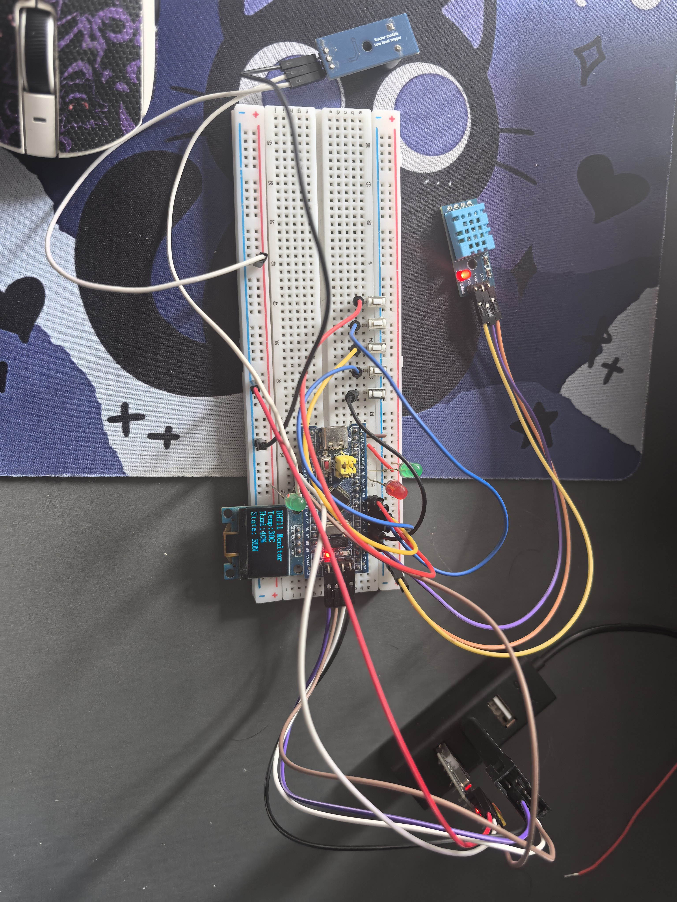

# 智能温湿度监测与报警系统（FreeRTOS 版）

基于 **STM32F103C8T6** 标准库 + **FreeRTOS V10.3.1** 开发的嵌入式多任务实战项目。在裸机版双层状态机架构的基础上，将传感器采集、OLED 显示、报警处理、按键扫描、状态机和历史记录拆分为 6 个独立任务，通过队列和互斥锁进行任务间协作。

> 本项目配套 [Python 上位机](https://github.com/Luoka666/upper_computer)，通过串口接收数据并在 PC 端绘制实时温湿度动态曲线，实现从单片机到 PC 端的完整数据闭环。
>
> 本项目同时维护两个版本：[裸机版（标准库状态机）](../Temperature_Humidity_Sensor_Alarm_System_BareMetal/) | **FreeRTOS 版（当前）**



---

## 目录

- [功能特性](#功能特性)
- [FreeRTOS 任务架构](#freertos-任务架构)
- [文件结构](#文件结构)
- [使用说明](#使用说明)
- [SPI 外部 Flash 阈值保存](#spi-外部-flash-阈值保存)
- [FreeRTOS 移植与重构踩坑记录](#freertos-移植与重构踩坑记录)
- [待优化方向](#待优化方向未来计划)
- [编译验证](#编译验证)

---

## 功能特性

裸机版全部功能 + FreeRTOS 新增特性：

- **多任务并发**：6 个独立 Task（Sensor / StateMachine / Alarm / Display / Record / Key）通过队列通信
- **队列解耦**：传感器数据通过 3 条队列分发给不同消费者，各 Task 独立消费互不抢夺
- **互斥锁 + 临界区**：OLED 访问双重保护，模块级互斥 + I2C 底层防抢占
- **历史数据保护**：独立 `historyMutex` 保护历史环形缓冲区的读写一致性
- **非阻塞延时**：`vTaskDelay()` 替代 `Delay_ms()`，CPU 不空转
- **非阻塞按键**：Key Task 每 10ms 扫描，驱动层连续采样消抖，不再等待按键松手
- **硬件定时器延时**：TIM2 提供微秒级精确延时，保护 DHT11 通信时序
- **传感器保护**：DHT11 每 2 秒采样一次，所有电平等待均带超时
- **队列防反压**：显示和报警队列覆盖旧值，历史队列满时淘汰最旧待处理数据
- **Tick Hook 兼容**：FreeRTOS Tick Hook 替代裸机 SysTick_Handler，保留 g_millis
- **SPI 阈值掉电保存**：SPI2 连接 3.3V W25Q64，K5 返回时保存两个阈值；开机读取，采用双扇区、CRC16 和最后提交标记，失败时提示重试。本轮不保存历史记录

---

## 架构演进过程

| 版本 | 说明 |
| :--- | :--- |
| v0.1 | 裸机 `if-else` 驱动 DHT11 与 OLED，验证底层硬件 |
| v0.2 | 引入 `SystemState` 枚举，搭建双层 `switch-case` 状态机骨架 |
| v0.3 | 补全 7 种状态的 UI 绘制函数，实现菜单光标导航 |
| v0.4 | 添加清屏优化机制，解决画面闪烁与字符残留 |
| v0.5 | 接入串口调试输出，定位按键误触发与状态横跳 Bug |
| v0.6 | 修正 GPIO 时钟与端口配置错误，按键功能恢复正常 |
| v0.7 | 引入环形缓冲区，重构历史记录存储与显示逻辑 |
| v0.8 | 集成非阻塞式 LED 报警闪烁，RUN 状态下菜单锁定 |
| v0.9 | 主循环升级为非阻塞事件驱动架构，重构延时函数保护系统心跳 |
| v1.0 | 移植 FreeRTOS：拆分为 6 个任务，使用队列和互斥锁通信 |
| v1.1 | 完成按键非阻塞化、DHT11 超时保护、队列防反压、共享数据同步和创建失败检查 |
| v1.2 | 接入 SPI2 / W25Q64 阈值保存：双扇区、校验、读回验证、默认值回退；已完成实物读写联调及保存后断电重启恢复验证 |

---

## FreeRTOS 任务架构

### 任务列表

| 任务 | 优先级 | 栈大小 | 周期 | 职责 |
|------|--------|--------|------|------|
| **Sensor** | 3（最高） | 128 | 2s 采样 / 50ms 状态检查 | RUN 状态下采集 DHT11，广播到 sensorQueue / alarmQueue / recordQueue |
| **StateMachine** | 2 | 256 | 事件驱动 | 从 keyQueue 取键值，管理 7 种系统状态跳转、UI 绘制和 K5 阈值保存 |
| **Alarm** | 2 | 128 | 50ms 状态检查 | 保存最新数据并判断阈值，LED+蜂鸣器以 500ms 周期报警 |
| **Display** | 1 | 256 | 事件驱动 | 从 sensorQueue 取数据，RUN 状态下刷新 OLED 温湿度显示 |
| **Record** | 1 | 128 | 事件驱动 | 从 recordQueue 取数据，写入环形缓冲区（复用裸机版 history_add） |
| **Key** | 1 | 128 | 10ms 轮询 | 调用非阻塞 Key_GetNum() 扫描按键，键值通过 keyQueue 发送 |

### 队列设计

| 队列 | 深度 | 数据类型 | 生产者 | 消费者 |
|------|------|----------|--------|--------|
| `sensorQueue` | 1 | `SensorData_t` | Sensor Task（覆盖写） | Display Task |
| `alarmQueue` | 1 | `SensorData_t` | Sensor Task（覆盖写） | Alarm Task |
| `recordQueue` | `HISTORY_SIZE` | `SensorData_t` | Sensor Task（满时淘汰最旧项） | Record Task |
| `keyQueue` | 5 | `uint8_t` | Key Task | StateMachine Task |

### 互斥锁

| 锁 | 保护对象 | 使用者 |
|----|----------|--------|
| `oledMutex` | OLED 模块级别访问互斥 | Display Task、StateMachine Task |
| `historyMutex` | 历史记录环形缓冲区 | Record Task、StateMachine Task |

OLED 底层 I2C 通信额外由 `taskENTER_CRITICAL()` 保护，互斥锁 + 临界区双重保护。

### 数据流

```
DHT11 → Sensor Task → sensorQueue → Display Task → OLED（RUN 状态下）
                    → alarmQueue  → Alarm  Task → LED/Buzzer
                    → recordQueue → Record Task → 环形缓冲区

按键 → Key Task → keyQueue → StateMachine Task → 状态跳转 + UI 绘制
```

### 优先级设计原则

- Sensor 优先级最高，DHT11 微秒级通信期间不能被其他任务抢占
- Alarm 优先级中等，数据到达时立即响应
- Display 和 Key 优先级最低且同级，时间片轮转，不干扰 Sensor
- 所有队列、互斥锁和任务创建结果都在启动调度器前检查，失败时进入明确的故障状态

### 裸机架构保留部分

- `Hardware/` 驱动层（OLED、LED、Key、Buzzer）沿用裸机版
- `System/` 逻辑层（DHT11、USART、alarm、UI、Record_storage）沿用裸机版
- `UI.c` 中的 UI 函数继续被 Display Task 调用
- `alarm.c` 中的 `alarm_run()` 逻辑已迁移到 Alarm Task
- 启动文件栈空间从 0x400 扩大到 0x800，向量表指向 FreeRTOS 中断处理函数

---

## 文件结构

```
/Hardware                  // 硬件驱动层（与裸机版共用）
├── OLED.c / OLED.h
├── Key.c / Key.h
├── LED.c / LED.h
├── buzzer.c / buzzer.h
├── SPI2_Flash.c / SPI2_Flash.h     // SPI2 总线：PB12~PB15，模式 0
├── W25Q64.c / W25Q64.h             // Flash 指令：ID、读、页编程、4KB 擦除
└── timer_delay.c / timer_delay.h   // TIM2 硬件定时器延时

/System                    // 系统逻辑层（与裸机版共用）
├── dht11.c / dht11.h
├── USART.c / USART.h
├── alarm.c / alarm.h
├── UI.c / UI.h
├── Record_storage.c / Record_storage.h
├── Threshold_storage.c / Threshold_storage.h // 阈值双扇区保存、恢复和校验
└── delay.c / delay.h

/FreeRTOS/Source           // FreeRTOS V10.3.1 内核
├── tasks.c / queue.c / list.c / timers.c ...
├── include/
└── portable/RVDS/ARM_CM3/ + MemMang/

/Tasks                     // FreeRTOS 任务层（新增）
├── task_sensor.c / .h       // 传感器采集任务
├── task_statemachine.c / .h // 状态机任务（7 状态跳转 + UI 绘制）
├── task_display.c / .h      // OLED 显示任务
├── task_alarm.c / .h        // 报警任务
├── task_record.c / .h       // 历史记录存储任务
└── task_key.c / .h          // 按键扫描任务

/User
├── main.c                 // 硬件初始化 + 队列/任务创建 + 启动调度器
├── FreeRTOSConfig.h       // FreeRTOS 内核配置（72MHz / 1ms tick / 10KB heap）
└── stm32f10x_it.c         // 中断服务（SysTick 由 FreeRTOS 接管，Tick Hook 维护 g_millis）
```

---

## 使用说明

### 硬件连接

| 外设 | STM32 引脚 | 说明 |
| :--- | :--- | :--- |
| **DHT11** | PA0 | 单总线数据引脚 |
| **OLED (I2C)** | SCL: PB8, SDA: PB9 | 0.96 寸 128x64 |
| **按键 K1** | PA1 | 运行/停止总开关 |
| **按键 K2** | PA2 | 菜单确认（阈值编辑页由 K5 保存） |
| **按键 K3** | PA3 | 向上/递增 |
| **按键 K4** | PA4 | 向下/递减 |
| **按键 K5** | PA5 | 设置/返回 |
| **报警 LED** | PA11 | 超阈值闪烁报警 |
| **蜂鸣器** | PA12 | 超阈值鸣叫报警 |
| **USART1** | TX: PA9, RX: PA10 | 串口发送至上位机 |
| **W25Q64 (SPI2)** | CS: PB12, SCK: PB13, MISO: PB14, MOSI: PB15 | 适用 3.3V 模块，保存阈值 |

### Keil 编译配置

- Options for Target → C/C++ → Include Paths 需添加：`User`、`Tasks`、`FreeRTOS/Source/include`、`FreeRTOS/Source/portable/RVDS/ARM_CM3`
- Target 需勾选 Use MicroLIB
- 新增的 `SPI2_Flash.c`、`W25Q64.c`、`Threshold_storage.c` 已加入 `Project.uvprojx`；若 Keil 原先开着旧工程，请重新打开工程以刷新文件列表。CMake 仍只用于 CLion 索引，不负责生成可烧录固件。

## SPI 外部 Flash 阈值保存

### 范围与硬件检查

本轮只修改 FreeRTOS 版，保留原有六任务和四队列，不改裸机版、不保存历史记录。历史仍是 RAM 中最近四条数据，掉电会丢失。

模块板上写 `W25Qxx` 只是系列标识，具体型号应看芯片本体/商品规格。当前驱动只接受 JEDEC ID `EF4017`、`EF7017` 的 W25Q64；其他型号返回错误且不擦写。不要为绕过错误随意去掉型号检查。

| 模块引脚 | STM32 | 含义 |
|---|---|---|
| VCC | 3.3V | 仅限确认支持 3.3V 的模块 |
| GND | GND | 共地 |
| CS | PB12 | 软件片选，低有效 |
| CLK / SCK | PB13 | SPI2 时钟 |
| DO / MISO | PB14 | Flash 输出，STM32 输入 |
| DI / MOSI | PB15 | STM32 输出，Flash 输入 |

**供电不能只看 W25Qxx 字样**：W25Q64JV 是 2.7~3.6V 系列，但 W25Q64JW 是 1.8V 系列。未确认电压时先断电核对模块规格；软件不能补救过压。如果模块另有 `/WP`、`/HOLD` 引脚，需要按其原理图保持非激活状态，不能悬空。不要带电插拔接线。

### 如何保存和验证

1. 确认供电规格后，重新打开 `Project.uvprojx`，编译并烧录；串口保持原来的 **9600、8N1**。
2. 首次空白 Flash：启动日志通常为 `Flash ID=EF4017 load=defaults driver=0 T=40 H=60`。默认值只在 RAM 中使用，开机不自动擦写。
3. STOP 下 K5 进入设置，K3/K4 选择 `Thresholds`，K2 确认。再选 `Temp` 或 `Humi` 并按 K2，K3/K4 修改阈值。
4. 在温度或湿度编辑页按 **K5**：先显示 `Saving...`，同时保存两个阈值。成功才返回阈值菜单，串口显示 `Threshold save=OK driver=0 T=... H=...`。
5. OLED 显示 `FAIL K5 to retry` 时尚未确认保存成功，仍留在编辑页。检查接线/型号/串口错误后按 K5 重试；修改值仍在 RAM，不能当作已持久化。
6. 成功后彻底断电再上电（注意断开调试器、USB 或其他可能反向供电的连接）。串口应显示 `load=OK`，进入阈值页应仍是刚才的值。
7. 不修改数值再次 K5 返回，日志应为 `unchanged`，不再次擦写。仅按上下键、未按 K5 就断电，应恢复上一次成功保存值。

上述步骤中的日志为预期格式示例；已取得的实物结果见下方记录。读回错误不自动清除保护位；受保护的芯片需先查明原因。

### 实物验证记录（2026-10-10）

- **型号识别**：Keil 调试中读取到 JEDEC ID `0xEF4017`，读 ID 成功标志为 `0x01`。
- **阈值写入**：串口先后收到 `Threshold save=OK driver=0 T=45 H=60` 和 `Threshold save=OK driver=0 T=45 H=65`，完整记录已写入并读回校验通过。
- **未变化跳过擦写**：保持 `T=45 H=65` 再次保存，收到 `Threshold save=unchanged driver=0 T=45 H=65`，未执行新的擦除和编程。
- **保存后断电恢复**：开发者已完成整板断电再上电验证，重新进入阈值页面后仍是修改并保存后的数值，确认配置可跨掉电恢复。

串口工具可能把一行日志分成多个接收块；以上保存日志按同一行内容拼接记录，不代表额外的数据帧。上述实测确认的是“保存完成后断电再启动”，不等同于“擦写进行中突然断电”的故障注入测试；后者当前仅在主机模拟测试中覆盖，不能宣称所有电源故障下都不丢数据。历史记录仍保存在 RAM，掉电不保留。

### 保存流程与分区

```
开机：初始化 SPI2 → 读取 ID → 读取 A/B 配置 → 校验 → 选最新有效值/默认值
K5：扫描已有配置 → 未变化则跳过 → 擦另一扇区 → 写正文 → 读回
    → 写提交标记 → 再读回核对 → 成功返回菜单
```

| 地址范围 | 用途 |
|---|---|
| `0x000000~0x000FFF` | 阈值配置 A，4KB |
| `0x001000~0x001FFF` | 阈值配置 B，4KB |
| `0x002000` 及之后 | 本轮不使用，留给后续历史分区 |

保存会擦除 A/B 中一个扇区，不能在这两个扇区放其他数据；没有提供整片擦除。每条配置是 15 字节：魔数、版本、两个阈值、序号、CRC16 和最后写入的提交标记。CRC16 参数为初值 `FFFF`、多项式 `1021`、不反射、不异或输出。

SPI 传输有有限轮询保护；Flash BUSY 最多进行 2000 次 1ms 等待，实际时间还受调度影响。擦写时释放 CS 并让出 CPU，不在长临界区中等待。当前只有开机初始化和 StateMachine 访问 Flash，运行期单一调用者，不另加 Flash 锁/任务。以后 Record 也用 Flash 时必须重新设计存储所有权或互斥保护，不能直接并发复用本接口。

双扇区可以在新记录不完整时回退旧记录，但不能替代芯片电源时序要求和真实掉电测试，也不是无限寿命的磨损均衡方案。

### 阅读顺序与测试

建议先看 `main.c` 中 `ThresholdStore_Init()`，再看 `task_statemachine.c` 中 `SaveThresholds()` 和两个阈值编辑分支。然后从 `Threshold_storage.c` 的 `ThresholdStore_Save()` 往下追 `W25Q64.c` 的页编程/擦除，最后看 `SPI2_Flash.c` 的字节收发。新增代码均配有中文注释。

`Tests/test_threshold_storage.c` 在电脑上模拟 Flash，以真实 `W25Q64.c` / `Threshold_storage.c` 测试默认值、重启恢复、A/B 选择、CRC 损坏、未变化不擦写、写入中断、丢失读回、写保护、超时、边界和序号回绕。`Tests/host_stubs` **不加入固件**，只为测试提供替身。

在本项目目录用主机 GCC 可执行：

```powershell
gcc -std=c99 -Wall -Wextra -Werror -Wconversion -ITests/host_stubs -IHardware -ISystem Tests/test_threshold_storage.c Hardware/W25Q64.c System/Threshold_storage.c -o test_threshold_storage.exe
.\test_threshold_storage.exe
```

模拟测试不覆盖实际 SPI 寄存器、接线、电压和实物断电行为。阈值保存、未变化跳过擦写及保存完成后的实物断电恢复已验证；擦写过程中突然断电、原有按键/采集/显示/报警/历史菜单的完整回归以及任务栈高水位检查仍需单独执行，不能由模拟测试通过推断为实物全部通过。

参考：[Winbond W25Q64JV 数据手册](https://www.mouser.com/catalog/specsheets/Winbond%20Electronics%20Corporation_08-25-2025_W25Q64JV.pdf)、[Winbond 电压系列选型资料](https://www.winbond.com/productResource-files/Winbond%20Automotive%20Flash%20Product%20Brief_EN_2024Q3_v1.pdf)。

---

## FreeRTOS 移植与重构踩坑记录

### 故障现象01
编译报错 `identifier "sensorQueue" is undefined`、`identifier "SensorData_t" is undefined` 等符号未定义。

### 故障原因01
新建的 `Tasks/` 文件夹路径未添加到 Keil 的 C/C++ 包含路径中，编译器找不到 `task_sensor.h` 等头文件。

### 解决方案01
Options for Target → C/C++ → Include Paths 添加 `Tasks` 文件夹路径。

---

### 故障现象02
编译通过，链接时报 `L6200E: Symbol SysTick_Handler multiply defined`，由 `stm32f10x_it.o` 和 `port.o` 重复定义。

### 故障原因02
裸机工程中 `stm32f10x_it.c` 定义了 `SysTick_Handler`，而 FreeRTOS 的 `port.c` 也需要接管 SysTick。两个文件中存在同名函数，链接器不知道该用哪一个。

### 解决方案02
在 `FreeRTOSConfig.h` 中配置 `#define xPortSysTickHandler SysTick_Handler`，让 FreeRTOS 的 SysTick 处理函数替换原来的。删除 `stm32f10x_it.c` 中的 `SysTick_Handler` 定义，只保留 FreeRTOS 版本。

---

### 故障现象03
串口持续打印 `DHT11 fail`，传感器完全无法工作。烧录裸机程序到同一块板子上，DHT11 正常工作，排除硬件故障。

### 故障原因03
DHT11 的通信时序是微秒级的，FreeRTOS 的 SysTick 中断（每 1ms 一次）和任务调度会打断通信过程中的精确延时。裸机下使用的软件循环 `Delay_us` 基于 CPU 空转，精度受编译器优化等级影响，在 FreeRTOS 工程中与裸机工程可能存在差异。

最初尝试的三种保护方案——`vTaskSuspendAll()` 挂起调度器、`taskENTER_CRITICAL()` 进入临界区、`__disable_irq()` 关闭全局中断——均无效。后经排查，杜邦线接触不良是导致早期测试结果不稳定的隐藏因素。

### 解决方案03

- 更换所有杜邦线，确保物理连接可靠
- 使用硬件定时器 TIM2 实现精确微秒延时（配置为 1MHz 计数频率，每个计数 = 1μs），替代软件循环 `Delay_us`，同时提供 `Delay_ms_TIM` 用于毫秒级延时。硬件定时器的精度完全由硬件保证，不受任务调度、中断、编译器优化等任何软件因素影响，也不再需要关闭中断来保护时序

---

### 故障现象04
传感器任务发送约 6 次数据后停止，串口不再有任何输出。系统完全沉默，必须手动复位才能恢复。

### 故障原因04
队列深度为 5，使用 `portMAX_DELAY` 作为发送超时参数。传感器每 100ms 采集一次，往队列里塞一条数据。显示任务和报警任务尚未创建，队列没有消费者，数据只进不出。塞满 5 条后，第 6 次发送时任务永久进入阻塞态，等待永远不会到来的空位。

### 解决方案04

- 立即修复：创建显示任务和报警任务作为消费者，从队列取数据，让队列有进有出
- 最终方案：`sensorQueue` 和 `alarmQueue` 深度设为 1，并使用 `xQueueOverwrite()` 始终保留最新采样值；`recordQueue` 满时先淘汰最旧待处理数据，再写入最新数据。任何消费者变慢都不会永久阻塞 Sensor Task

---

### 故障现象05
按一次按键 K1 后，串口短暂打印 `Key=1`，随后整个系统完全停止——串口不再打印温湿度数据，也不打印 `DHT11 fail`。如果不按任何按键，系统正常运行。

### 故障原因05

**直接原因**：传感器任务在 `xQueueSend` 上永久阻塞，队列满且无人消费。

**根本原因**：按键任务使用裸机版阻塞式 `Key_GetNum()`，内部有 `while(GPIO_ReadInputDataBit(...) == 0);` 等待松手的死循环。按键按下后，这个循环会空转约 150ms（人的按键时长）。在这期间，按键任务不调用任何 FreeRTOS 阻塞 API（`vTaskDelay`、`xQueueReceive` 等），内核不知道它在"等待"，只以为它在"执行"。按键任务和传感器任务当时是同优先级（均为 2），内核不会把 CPU 从"正在工作"的按键任务切走，传感器任务被"饿死"——处于就绪态，但得不到 CPU 时间。传感器任务被暂停期间，显示任务和报警任务也得不到执行，队列中的数据无人消费。按键松手后，传感器任务恢复，但队列可能已满，`xQueueSend` 上的 `portMAX_DELAY` 让任务永久阻塞。整个系统进入死锁状态。

**为什么裸机没有这个问题**：裸机下只有一个主循环，死等松手不影响任何其他逻辑。FreeRTOS 下多个任务共享 CPU，一个任务死等等于剥夺其他任务的 CPU 时间。

### 解决方案05

- 将 `Key_GetNum()` 重写为非阻塞状态式消抖，每次调用只采样一次 GPIO，不再使用 `while(等待松手)`
- Key Task 每 10ms 调用一次，连续两次采样一致才确认状态，一次稳定按下只发送一个事件
- `keyQueue` 使用零等待发送，即使队列暂时已满也不会阻塞按键任务
- 删除重复的软件定时器扫描路径，并关闭未使用的 FreeRTOS 软件定时器功能

---

### 故障现象06
系统运行过程中 OLED 随机黑屏，但串口继续正常打印温湿度数据，传感器采集和报警功能均正常。按 K1 切换到 RUN 状态后，屏幕有时能恢复显示。

### 故障原因06
软件模拟 I2C 在多任务环境下被抢占。两个任务（显示任务和状态机任务）可能同时尝试操作 OLED，虽然外层有互斥锁保护，但在 `OLED_WriteCommand` 和 `OLED_WriteData` 内部，I2C 的 SDA 数据线在通信过程中可能被另一个任务的 I2C 操作打断，导致 SDA 被拉低后无法释放，I2C 总线进入死锁状态。OLED 收不到完整的命令序列，内部状态机混乱，屏幕黑屏。

### 解决方案06
在 `OLED_WriteCommand` 和 `OLED_WriteData` 函数的前后，添加 `taskENTER_CRITICAL()` / `taskEXIT_CRITICAL()` 保护。确保每次 I2C 通信的完整字节传输期间，不被任何中断或任务切换打断。临界区保护的是最底层的硬件操作，而互斥锁保护的是 OLED 模块级别的访问互斥，两者配合形成完整的保护方案。

---

### 故障现象07
系统上电后 OLED 黑屏。按 K1 进入 RUN 状态后，屏幕正常显示温湿度数据。切回 STOP 状态后，屏幕再次黑屏。

### 故障原因07
FreeRTOS 是多任务事件驱动架构。状态机任务默认 `currentState = STOP`，但它只在收到按键事件时才执行 UI 绘制。开机后没有任何按键事件触发，状态机任务一直阻塞在 `xQueueReceive(keyQueue, ...)` 上，永远不会主动去画 STOP 界面。裸机下主循环每轮都会检查状态并执行对应的 UI 函数，RTOS 下没有这个"每轮都检查"的机制。

### 解决方案07
在 `main()` 函数中，创建所有任务之前、启动调度器之前，手动调用一次 `stop_ui()` 绘制开机默认界面。此时调度器尚未启动，不存在多任务竞争，可以安全地直接操作 OLED。后续状态切换时的 UI 重绘由状态机任务负责，显示任务负责 RUN 状态下的 `run_ui` 实时刷新。

---

## 待优化方向（未来计划）

- SPI 外部 Flash 历史记录存储（阈值保存及保存后实物断电恢复已验证；历史持久化尚未实现）
- 增加 DHT11 连续失败计数、故障状态上报和 OLED 提示
- 增加栈高水位与剩余堆空间监控，便于长期运行分析
- 利用 RTC 唤醒 + STOP 低功耗模式

## 编译验证

- Keil MDK / ARMCC 5.06 update 5
- 2026-10-10 SPI 阈值功能完整 Rebuild：`0 Error(s), 0 Warning(s)`
- 程序大小：Code 18548 B，RO-data 1848 B，RW-data 216 B，ZI-data 13320 B
- 主机 GCC 严格警告编译通过，20 项模拟测试通过
- 2026-10-10 实物验证：JEDEC ID `EF4017`、阈值写入及读回成功、未变化跳过擦写、保存完成后整板断电重启恢复修改值
- 验证边界：擦写中突然断电的实物故障注入及任务栈高水位检查尚未完成，历史记录仍仅存 RAM

---

## 相关链接

- [裸机版（标准库状态机）](../Temperature_Humidity_Sensor_Alarm_System_BareMetal/)
- [Python 串口上位机](https://github.com/Luoka666/upper_computer)
